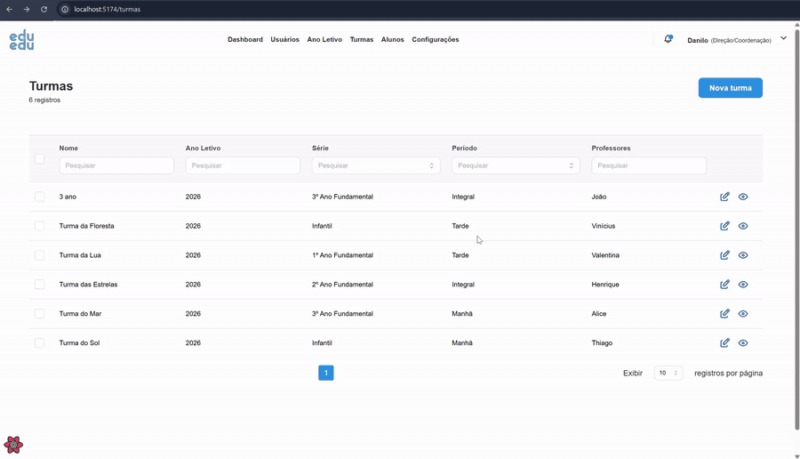

<p align="center">
  
</p>

<h1 align="center">EduEdu+ Escola Admin</h1>

<p align="center">
  Interface administrativa da plataforma EduEdu+, um sistema de avaliação, monitoramento e acompanhamento da alfabetização para escolas brasileiras.
</p>

<p align="center">
  <a href="#-demonstração">Demonstração</a> &bull;
  <a href="#sobre-o-projeto">Sobre</a> &bull;
  <a href="#tecnologias">Tecnologias</a> &bull;
  <a href="#pré-requisitos">Pré-requisitos</a> &bull;
  <a href="#instalação">Instalação</a> &bull;
  <a href="#estrutura-do-projeto">Estrutura</a> &bull;
  <a href="#rotas-da-aplicação">Rotas</a> &bull;
  <a href="#conceitos-de-domínio">Domínio</a> &bull;
  <a href="#scripts-disponíveis">Scripts</a> &bull;
  <a href="#variáveis-de-ambiente">Ambiente</a> &bull;
  <a href="#deploy">Deploy</a> &bull;
  <a href="#contribuindo">Contribuindo</a> &bull;
  <a href="#licença">Licença</a>
</p>

## 🎬 Demonstração

<p align="center">
  
</p>

---

## Sobre o Projeto

O **EduEdu+ Escola Admin** é o painel administrativo da plataforma educacional EduEdu+, destinado a diretores, coordenadores pedagógicos e professores.

Por meio dele, é possível gerenciar turmas, acompanhar o desempenho dos estudantes nos diferentes eixos da alfabetização, aplicar avaliações diagnósticas, gerar relatórios em PDF e configurar parâmetros da escola.

A plataforma foi desenvolvida para apoiar o monitoramento da aprendizagem e a tomada de decisão pedagógica baseada em dados, contribuindo para a personalização do ensino e para o acompanhamento do progresso dos estudantes ao longo do ano letivo.

### Funcionalidades Principais

- **Dashboard** &mdash; Visão geral do desempenho da escola por série, turma e eixo de aprendizagem, com indicadores educacionais e acompanhamento da evolução dos estudantes
- **Gestão de turmas** &mdash; Criação, edição e acompanhamento de turmas, incluindo desempenho em provas e atividades (planetas)
- **Gestão de estudantes** &mdash; Cadastro individual ou em massa (via planilha), acompanhamento detalhado do desempenho e liberação para realização de provas e mais atividades (planetas)
- **Gestão de usuários** &mdash; Cadastro e gerenciamento de diretores, coordenadores e professores, com controle de perfis e status de acesso
- **Ano letivo** &mdash; Criação de anos letivos e promoção de estudantes entre séries
- **Relatórios** &mdash; Geração de relatórios detalhados por estudante e por turma, com exportação em PDF (por área, prova ou planeta)
- **Sincronização** &mdash; Sincronização de planetas e provas com o backend por meio de filas assíncronas, com notificações de progresso em tempo real
- **Configurações** &mdash; Configuração da escola, acompanhamento do status de sincronização e acesso ao log de auditoria
- **Configuração inicial** &mdash; Assistente de configuração para apoiar a implantação e a primeira utilização da plataforma na escola

### Repositórios Relacionados

| Repositório                                                                      | Descrição                                    |
| -------------------------------------------------------------------------------- | -------------------------------------------- |
| [eduedu-escola-setup](https://github.com/instituto-abcd/eduedu-escola-setup)     | Pacote de instalação e orquestração (Docker) |
| [eduedu-escola-backend](https://github.com/instituto-abcd/eduedu-escola-backend) | API backend (NestJS + Prisma + MongoDB)      |
| [eduedu-escola-aluno](https://github.com/instituto-abcd/eduedu-escola-aluno)     | Interface do aluno                           |

---

## Tecnologias

| Categoria       | Tecnologia                                                    |
| --------------- | ------------------------------------------------------------- |
| Framework       | [React](https://react.dev/) 18                                |
| Build Tool      | [Vite](https://vitejs.dev/) 4                                 |
| Linguagem       | TypeScript 5 (strict mode)                                    |
| UI Components   | [Mantine](https://mantine.dev/) v6                            |
| Estado Servidor | [TanStack React Query](https://tanstack.com/query) v4         |
| Estado Cliente  | [Zustand](https://zustand-demo.pmnd.rs/) + persist middleware |
| HTTP Client     | [Axios](https://axios-http.com/)                              |
| Roteamento      | [React Router DOM](https://reactrouter.com/) v6               |
| Validação       | [Zod](https://zod.dev/)                                       |
| Gráficos        | [Chart.js](https://www.chartjs.org/) + react-chartjs-2        |
| PDF             | [@react-pdf/renderer](https://react-pdf.org/) + jsPDF         |
| Ícones          | [@tabler/icons-react](https://tabler.io/icons)                |
| Datas           | [Day.js](https://day.js.org/)                                 |
| Containerização | Docker + nginx                                                |
| CI/CD           | GitHub Actions + Google Cloud Run                             |

---

## Pré-requisitos

- [Node.js](https://nodejs.org/) 18+
- [npm](https://www.npmjs.com/) 8+
- Backend rodando localmente ou acessível (veja [eduedu-escola-backend](https://github.com/instituto-abcd/eduedu-escola-backend))

---

## Instalação

### 1. Clone o repositório

```bash
git clone https://github.com/instituto-abcd/eduedu-escola-admin.git
cd eduedu-escola-admin
```

### 2. Instale as dependências

```bash
npm install
```

### 3. Configure a URL da API

O projeto usa um arquivo `public/config.js` para configuração em runtime. Para desenvolvimento, edite este arquivo:

```javascript
window.config = {
  API_URL: "http://localhost:3000",
  APP_VERSION: "<versão do package.json>",
};
```

### 4. Inicie o servidor de desenvolvimento

```bash
# Modo local (offline)
npm run local

# Modo desenvolvimento (conecta ao backend de dev)
npm run dev

# Modo QA
npm run qa
```

A aplicação estará disponível em `http://localhost:5173`.

### Credenciais de teste

Com o backend rodando em modo `development` e com o seed aplicado:

| Perfil    | E-mail                | Senha      | Chave de Acesso |
| --------- | --------------------- | ---------- | --------------- |
| Diretor   | `diretor@email.com`   | `12345678` | `EDUEDU001`     |
| Professor | `professor@email.com` | `12345678` | `EDUEDU002`     |

---

## Estrutura do Projeto

```
src/
├── main.tsx                    # Entry point da aplicação
├── App.tsx                     # Componente raiz (QueryClient + ThemeProvider)
│
├── api/                        # Camada de API (Axios + React Query)
│   ├── base.ts                 # Classe base com config Axios e interceptors
│   ├── auth.ts                 # Login e recuperação de senha
│   ├── student.ts              # CRUD de alunos e desempenho
│   ├── school-class.ts         # Gestão de turmas
│   ├── school-year.ts          # Gestão de anos letivos
│   ├── user.ts                 # Gestão de usuários
│   ├── sync.ts                 # Sincronização de planetas e provas
│   ├── dashboard.ts            # Dados do dashboard
│   ├── settings.ts             # Configurações e status
│   ├── audit.ts                # Log de auditoria
│   ├── notification.ts         # Notificações
│   └── api-types.d.ts          # Tipos compartilhados
│
├── pages/                      # Páginas organizadas por feature
│   ├── Login/                  # Autenticação
│   ├── Dashboard/              # Visão geral da escola
│   ├── Classes/                # Gestão de turmas (listagem, detalhes, criação)
│   ├── Students/               # Gestão de alunos (listagem, detalhes, edição)
│   ├── Users/                  # Gestão de usuários
│   ├── SchoolYear/             # Ano letivo e promoção de alunos
│   ├── Reports/                # Relatórios por aluno e turma (PDF)
│   ├── Settings/               # Configurações e auditoria
│   └── Setup/                  # Assistente de configuração inicial
│
├── components/                 # Componentes reutilizáveis
│   ├── Layout/                 # Layout principal com verificação de autenticação
│   ├── Navbar/                 # Barra de navegação
│   ├── Footer/                 # Rodapé
│   ├── SyncButton/             # Botão de sincronização
│   ├── Pagination/             # Controles de paginação
│   ├── PageHeader/             # Cabeçalho de página
│   ├── TableHeader/            # Cabeçalho de tabela com ordenação
│   ├── TableLoader/            # Skeleton de carregamento
│   └── ...                     # Outros componentes UI
│
├── stores/                     # Stores Zustand
│   ├── user.ts                 # Estado de autenticação (persistido)
│   └── filter.ts               # Filtros e estado de sincronização
│
├── routes/                     # Definições de rotas por módulo
│   ├── index.tsx               # Composição de todas as rotas
│   ├── Auth.tsx                # Rotas de autenticação
│   ├── Dashboard.tsx           # Rotas do dashboard
│   ├── Classes.tsx             # Rotas de turmas
│   ├── Students.tsx            # Rotas de alunos
│   ├── Users.tsx               # Rotas de usuários
│   ├── SchoolYear.tsx          # Rotas de ano letivo
│   ├── Settings.tsx            # Rotas de configurações
│   ├── Report.tsx              # Rotas de relatórios
│   └── Setup.tsx               # Rotas de setup
│
├── constants/                  # Constantes da aplicação
│   ├── path.ts                 # Paths das rotas
│   └── index.ts                # Labels em português e opções de select
│
├── hooks/                      # Custom hooks
│   └── usePagination.ts        # Hook de paginação
│
├── providers/                  # Context providers
│   └── ThemeProvider.tsx        # Configuração do tema Mantine
│
├── styles/                     # Overrides de estilo dos componentes Mantine
│
├── utils/                      # Funções utilitárias
│   ├── decodeJwt.ts            # Decodificação de JWT
│   ├── pdfDownload.ts          # Geração e download de PDFs
│   ├── errorNotification.ts    # Notificações de erro
│   ├── successNotification.ts  # Notificações de sucesso
│   └── chartMap.ts             # Mapeamento de dados para gráficos
│
└── assets/                     # Assets estáticos (backgrounds, logos)

public/
└── config.js                   # Configuração em runtime (API_URL, APP_VERSION)
```

### Padrão dos Módulos de API

Cada arquivo em `src/api/` segue o padrão:

```typescript
// Classe com métodos estáticos para chamadas HTTP
export class StudentAPI extends API {
  static getAll(params: Params) {
    return this.api.get<Response>("/student", { params });
  }
}

// Hooks React Query para uso nos componentes
export function useStudentGetAll(params: Params) {
  const handler = useCallback(() => StudentAPI.getAll(params), [params]);
  return useQuery([KEY.STUDENTS, params], handler);
}
```

### Stores Zustand

```typescript
// Estado de autenticação (persistido no localStorage)
export const useUserStore = create<UserStore>()(
  persist(
    (set) => ({
      accessToken: "",
      profile: "TEACHER",
      isUserAuthenticated: () => /* verifica se há token válido */,
      signOut: () => set({}, true),
    }),
    { name: "user_state" }
  )
);
```

---

## Rotas da Aplicação

| Rota                          | Descrição                          | Acesso      |
| ----------------------------- | ---------------------------------- | ----------- |
| `/login`                      | Autenticação                       | Público     |
| `/setup`                      | Configuração inicial da escola     | Público     |
| `/dashboard`                  | Dashboard com desempenho por série | Autenticado |
| `/turmas`                     | Listagem de turmas                 | Autenticado |
| `/turmas/nova-turma`          | Criação de turma                   | Autenticado |
| `/turmas/:classId`            | Detalhes da turma                  | Autenticado |
| `/turmas/editar/:classId`     | Edição de turma                    | Autenticado |
| `/alunos`                     | Listagem de alunos                 | Autenticado |
| `/alunos/novo-aluno`          | Cadastro de aluno                  | Autenticado |
| `/alunos/:studentId/editar`   | Edição de aluno                    | Autenticado |
| `/alunos/:studentId/detalhes` | Detalhes e desempenho do aluno     | Autenticado |
| `/usuarios`                   | Gestão de usuários                 | Autenticado |
| `/ano-letivo`                 | Gestão de anos letivos             | Autenticado |
| `/configuracoes`              | Configurações e sincronização      | Autenticado |
| `/relatorio`                  | Relatórios em PDF                  | Autenticado |

### Autenticação

- Autenticação via JWT com token armazenado no Zustand (persistido no `localStorage`)
- A classe base `API` adiciona o header `Authorization: Bearer <token>` automaticamente via interceptor Axios
- Rotas autenticadas utilizam o componente `Layout` que verifica a autenticação
- Perfis: `DIRECTOR` (Direção/Coordenação) e `TEACHER` (Professor)
- Validação de token via endpoint `login/token-valido`

---

## Conceitos de Domínio

| Termo          | Descrição                                                   |
| -------------- | ----------------------------------------------------------- |
| **Turma**      | Classe escolar com série e período (manhã, tarde, integral) |
| **Aluno**      | Estudante com acompanhamento de desempenho                  |
| **Ano Letivo** | Ano acadêmico com estados: Rascunho, Ativo, Inativo         |
| **Planeta**    | Módulo de aprendizagem gamificado na plataforma EduEdu      |
| **Prova**      | Avaliação diagnóstica aplicada aos alunos                   |
| **Eixos**      | Dimensões de aprendizagem avaliadas:                        |
|                | &bull; **ES** &mdash; Consciência fonológica                |
|                | &bull; **EA** &mdash; Sistema de escrita alfabética         |
|                | &bull; **LC** &mdash; Leitura e compreensão de texto        |
| **Série**      | Infantil, 1º ao 5º Ano do Ensino Fundamental                |

---

## Scripts Disponíveis

| Comando           | Descrição                      |
| ----------------- | ------------------------------ |
| `npm run local`   | Inicia em modo local/offline   |
| `npm run dev`     | Inicia em modo desenvolvimento |
| `npm run qa`      | Inicia em modo QA              |
| `npm run build`   | Compila para produção          |
| `npm run preview` | Preview do build de produção   |
| `npm run lint`    | Executa ESLint (zero warnings) |

---

## Variáveis de Ambiente

### Configuração em Runtime (`public/config.js`)

| Variável      | Descrição              | Exemplo                 |
| ------------- | ---------------------- | ----------------------- |
| `API_URL`     | URL do backend EduEdu+ | `http://localhost:3000` |
| `APP_VERSION` | Versão da aplicação (deve refletir `package.json`) | `1.21.0` |

A aplicação **não** utiliza variáveis de ambiente do Vite (`VITE_*`) para a URL da API. Em vez disso, usa o objeto `window.config` carregado do script `public/config.js`, permitindo configuração em runtime sem rebuild da imagem Docker.

---

## Deploy

### Docker

O projeto inclui um `Dockerfile` com build multi-stage (Node 18 + nginx):

```bash
docker build -t eduedu-escola-admin .
docker run -p 80:80 -e API_URL=https://api.exemplo.com -e APP_VERSION=1.0.0 eduedu-escola-admin
```

O `entrypoint.sh` gera o `config.js` automaticamente a partir das variáveis de ambiente no momento da inicialização do container, permitindo configurar a API por ambiente sem reconstruir a imagem.

---

## Git Workflow

O projeto segue o modelo **Gitflow**:


- `main` &mdash; Branch de produção
- `staging` &mdash; Branch de homologação
- `development` &mdash; Branch de desenvolvimento
- `feature/*` &mdash; Branches de funcionalidades
- `hotfix/*` &mdash; Correções urgentes

---

## Contribuindo

Contribuições são bem-vindas! Para contribuir:

1. Faça um fork do repositório
2. Crie uma branch para sua feature (`git checkout -b feature/minha-feature`)
3. Faça commit das suas alterações (`git commit -m 'feat: descrição da feature'`)
4. Faça push para a branch (`git push origin feature/minha-feature`)
5. Abra um Pull Request

### Diretrizes

- Siga os padrões de código existentes
- Use TypeScript com tipos explícitos (strict mode)
- Use o alias `~/` para imports absolutos a partir de `src/`
- Siga o padrão de API existente (classe estática + hooks React Query)
- Mantenha componentes pequenos e focados
- Execute `npm run lint` antes de enviar seu PR

---

## Licença

Este projeto é mantido pelo [Instituto ABCD](https://www.institutoabcd.org.br/).

Consulte o arquivo [LICENSE](LICENSE.md) para mais detalhes.
